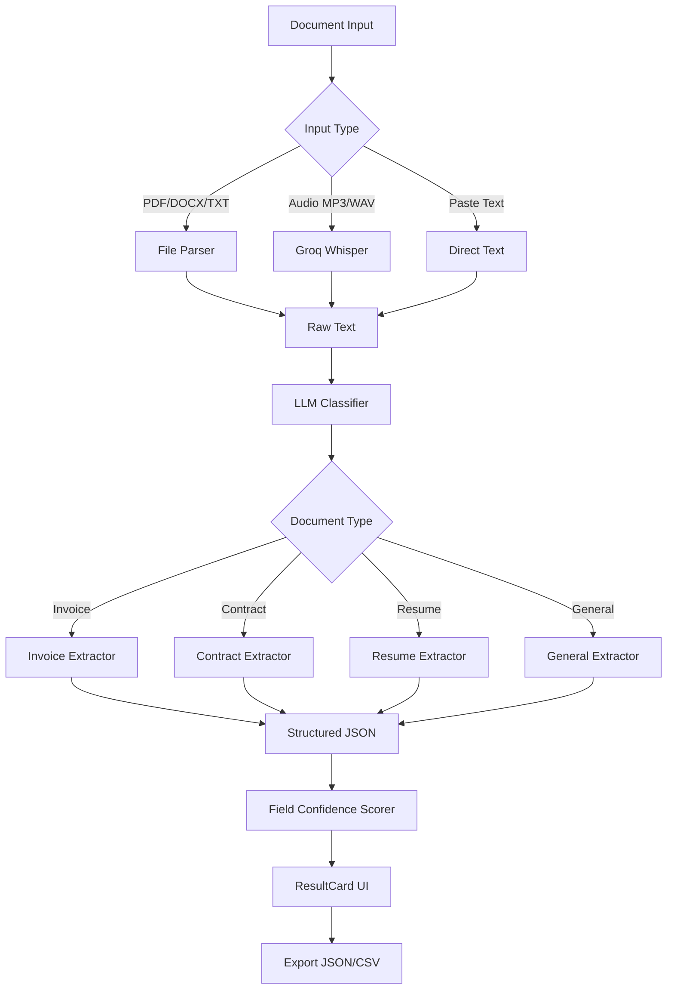

# Parsify AI

### Intelligent Document Extraction

[](https://react.dev/)
[](https://fastapi.tiangolo.com/)
[](https://groq.com/)
[](https://llama.meta.com/)
[](https://github.com/openai/whisper)
[](https://firebase.google.com/)
[](https://www.python.org/)
[](LICENSE)

[**Live Demo**](https://parsify-ai.web.app/) · [**GitHub**](https://github.com/kokilamariyayi/parsify-ai)

---

## About

**Parsify AI** transforms unstructured documents — invoices, contracts, resumes, and more — into clean, structured JSON you can export, integrate, or review in seconds.

Inspired by **Apple Intelligence** and its on-device document extraction pipelines, Parsify AI applies a similar classify → extract → score workflow using Groq’s LLaMA-3 and Whisper models to deliver fast, accurate field-level parsing from files, pasted text, or audio uploads.

---

## Features

- **Multi-document type detection** — Invoice, Contract, Resume, and General
- **Two-stage LLM pipeline** — Classify document type, then extract schema-aware fields
- **Field-level confidence scoring** — Per-field scores with low-confidence highlights in the UI
- **Audio transcription** — Upload MP3, WAV, M4A, OGG, or WEBM; transcribed via Groq Whisper
- **Extraction history** — Recent results saved in browser localStorage (up to 10 entries)
- **Export as JSON and CSV** — Download or copy structured output instantly
- **Dark themed responsive UI** — Professional SaaS-style interface on desktop and mobile

---

## Architecture



---

## Tech Stack

| Technology | Purpose |
|---|---|
| React + Vite + Tailwind CSS | Frontend UI |
| FastAPI | Backend API |
| Groq LLaMA-3.3-70B | Document classification and extraction |
| Groq Whisper Large V3 | Audio transcription |
| PyMuPDF | PDF parsing |
| python-docx | DOCX parsing |
| Firebase Hosting | Frontend deployment |
| localStorage | Extraction history |

---

## Screenshots

| Homepage | Extraction Result |
|:---:|:---:|
|  |  |

| Audio Upload | Extraction History |
|:---:|:---:|
|  |  |

---

## Getting Started

### Prerequisites

- Python 3.10+
- Node.js 18+
- Groq API key (free at [console.groq.com](https://console.groq.com/))

### Backend Setup

```bash
cd backend
python -m venv venv
venv\Scripts\activate
pip install -r requirements.txt
```

Create a `.env` file in `backend/`:

```env
GROQ_API_KEY=your_key
```

Start the API server:

```bash
uvicorn main:app --reload
```

API runs at **http://localhost:8000**

### Frontend Setup

```bash
cd frontend
npm install
npm run dev
```

App runs at **http://localhost:5173**

---

## Sample Output

```json
{
  "document_type": "invoice",
  "confidence": 0.97,
  "fields": {
    "invoice_number": "INV-1042",
    "invoice_date": "2026-06-20",
    "vendor_name": "Tech Solutions Pvt Ltd",
    "total_amount": 85000,
    "currency": "INR",
    "due_date": "2026-07-15",
    "payment_terms": "Net 30"
  }
}
```

---

## Resume Metrics

> Built a multi-stage LLM extraction pipeline achieving structured field parsing across invoice, contract, and resume document types with per-field confidence scoring and audio transcription support.

---

## License

MIT License — see [LICENSE](LICENSE) for details.

---

## Author

**Kokila M**

- Portfolio: [kokilam-portfolio.web.app](https://kokilam-portfolio.web.app/)
- GitHub: [@kokilamariyayi](https://github.com/kokilamariyayi)
- LinkedIn: [Kokila M](https://www.linkedin.com/in/kokila-m-aba1572b0/)

---

<p align="center">
  <strong>Parsify AI</strong> — Intelligent Document Extraction<br/>
  <a href="https://parsify-ai.web.app/">Live Demo</a> ·
  <a href="https://github.com/kokilamariyayi/parsify-ai">Source Code</a>
</p>
